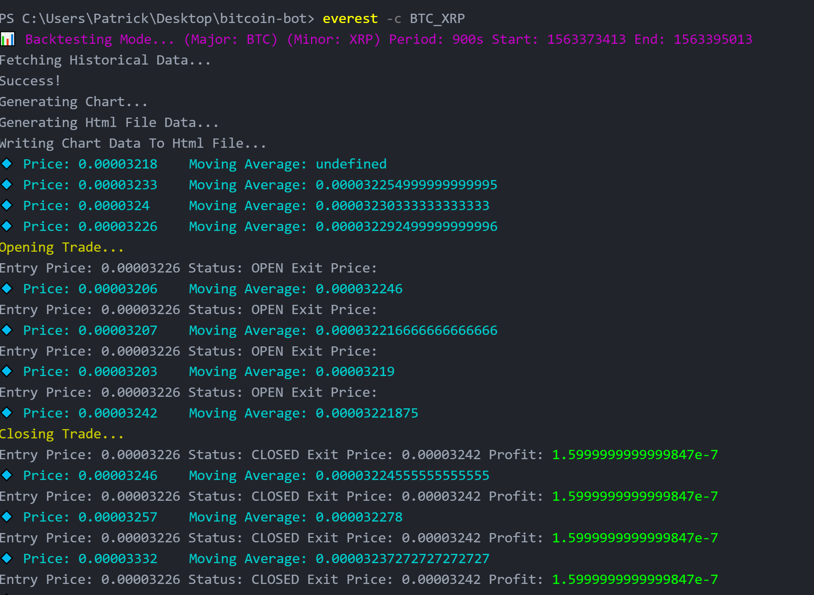
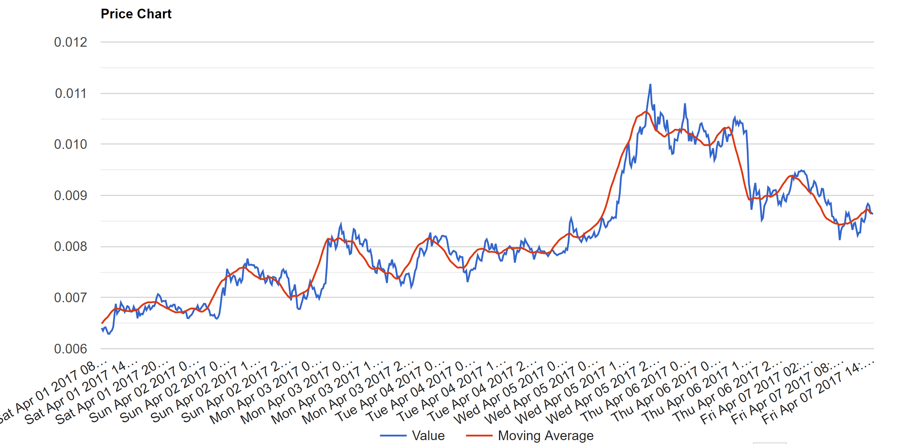
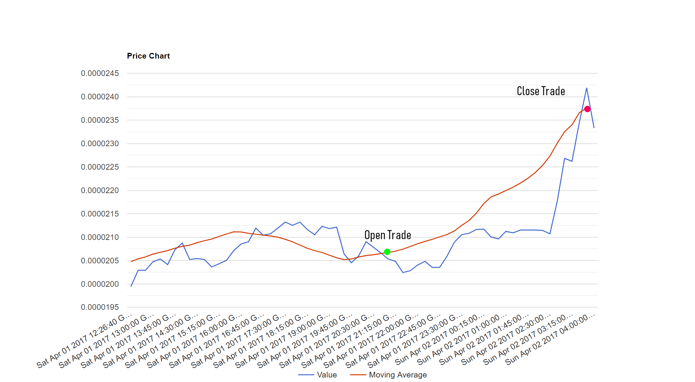
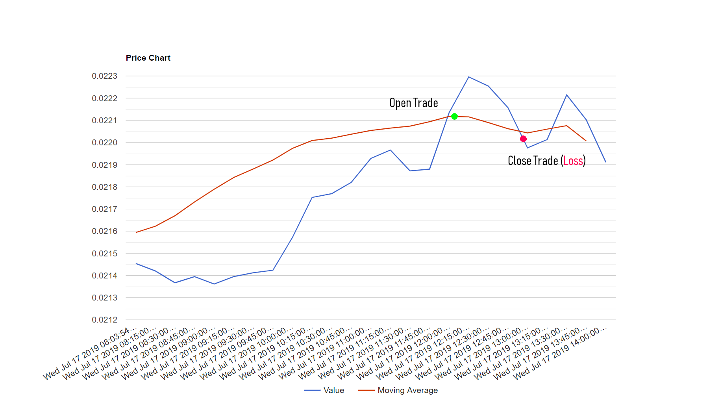

# Everest
:robot: Live-trading crypto bot for the [Poloniex](https://poloniex.com/) exchange.

## :sparkles: Getting Started
To get started, you need a Poloniex account. If you don't have one already, create a new account [here](https://poloniex.com/).

After creating and verifying your account you need to [enable API access](https://poloniex.com/apiKeys) in order to access your API Key and Secret.

*You don't need to deposit any coins in your Poloniex account yet to use this bot unless you are in `--live --real` mode.

### :wrench: Installation
To install Everest, run the following command:
```javascript
npm install --global everestjs
```
Now that you have Everest installed, you need to set your Poloniex API credentials:
```javascript
everest --config
```
After you've set your API key and secret, Everest is ready to go! Everest has two modes - **Live-Trading** mode and **Backtesting** mode. Everest, by default without passing in the `--live` flag, is in **Backtesting** mode.

## :rewind: Backtesting Mode
**Backtesting** mode allows you to simulate and create graphs of past price trends and averages to see what Everest ***would have*** done and profit you would have made if you were running live. Profit is defined as the difference between the Trade Entry Price and the Trade Exit Price.

To run a Backtest, run Everest and pass in a `-c` currency pair (**required**) without passing in the `--live` flag:
```javascript
everest -c BTC_XRP
```
This command generates a simulation of Everest's activity within some period of time in the past. By default, the Backtester will simulate the last 6 hours of crypto prices for that currency pair.


You can also define a custom period of time to simulate by passing in `-s` start time and `-e` end time flags. These times need to be in [**Unix epoch**](https://www.epochconverter.com/) format.
```javascript
everest -c BTC_LTC -s 1491048000 -e 1491591200
// Generate simulation from April 1, 2017 to April 7, 2017.
```
Everest will also generate a line chart that shows the Values and Moving Averages (length 15) of the currency pair over that time interval. This chart will be saved in your Home (`cd ~`) directory.



You may also pass in a `-p` period in seconds that defines the candlestick width of your backtesting data. The default period is 900 seconds (15 minutes). The accepted values are [300, 900, 1800, 7200]. The shorter (smaller) your period, the more detailed your chart will look.
```javascript
everest -c BTC_DASH -p 300
// Generate chart simulation with period of 5 minutes (Most detailed!)
```

## :moneybag: Live-Trading Mode
**Live-Trading** mode allows Everest to make trades automatically based off of certain [indicators](https://www.investopedia.com/articles/active-trading/041814/four-most-commonlyused-indicators-trend-trading.asp). Currently, Everest only supports the Moving Average indicator to determine when a trade should take place. I'm looking to add more indicators such as Relative Strength Index, MACD, and EMA in the near future.

You may start live-trading by passing in the `--live` flag:
```javascript
everest -c BTC_XRP --live
```
Everest will begin ticking. Everest's main **objective** is to buy *X* units of Minor currency with your Major currency. Wait for the price to go up.  Then, sell the *X* units of minor currency back for a profit. The default trade amount is **0.01** units. You can define a custom trade amount by passing in the `-t` trade amount flag.
```javascript
everest -c BTC_XRP -t 0.5 --live
// Start live trading with the trade amount of 0.5 units
```

The Minor currency is the last coin in the currency pair, while the Major currency is the first. For example, in the `BTC_XRP` currency pair, XRP would be the Minor currency and BTC is the Major currency. Minor currency is the currency you want to buy. Major currency is what you already have in your account.

**IMPORTANT!** - At this point, Everest is not currently using your real crypto yet! It will only tell you when it *would* place a trade and what profits you *would have* made. To start trading real currency, you must pass in the `--real` flag.

```javascript
everest -c BTC_XRP -t 0.5 --live --real
// Start live trading with real crypto from your Poloniex account
```
Everest begins a new period and ticks every 10 seconds. Each tick requests the latest prices of the currency pair and displays that information. Each period, by default, lasts **120 seconds**. At the beginning of every period, Everest will create a new [candlestick](https://www.investopedia.com/trading/candlestick-charting-what-is-it/). A candlestick is a data structure that keeps track of the Opening Price, Closing Price, High, and Low prices of the currency pair over that period. You can define your own period length by passing in the `-i` interval flag.

```javascript
everest -c BTC_DASH -t 0.5 -i 300 --live
// Start live trading with 5 minute period between Trade attempts
```

 At the end of every period (except the first), Everest will calculate the Moving Average of the last 15 ticks and compare it to the current price and determine if it wants to open a Trade. If the Moving Average is **greater than** the current price, Everest opens a Trade (buys *X* units of the Minor currency) in expectation that the price will eventually rise to meet the growing Moving Average. When the Moving Average **falls below** the current price, Everest closes the trade (sells *X* units of Minor currency back to the market).


Currently, the Moving Average indicator is the only indicator supported. Support for MACD, RSI, and EMA is on the radar for the near future.

**Notice!** Be aware that this indicator does not guarantee profit. It's possible that a trade looks like this:



## :signal_strength: Indicators
### (Current) Simple Moving Average
### (Planning) EMA, RSI, MACD

## Options
`-c --currency` - For Backtesting and Live-Trading: The currency pair you want to trade with in MAJ_MIN format. [**Default** - BTC_ETH]

`-p --period` - For Backtesting: The candlestick width (in seconds) of your backtesting data. Accepted values are [300, 900, 1800, 7200]. The smaller your period, the more detailed your chart will be.  [**Default** - 900] (**Optional**)

`-s --start` - For Backtesting: The start time of Backtesting data you want to retrieve [**Default** - 6 hours in the past] (**Optional**)

`-e --end` - For Backtesting: The end time of Backtesting data you want to retrieve [**Default** - Now] (**Optional**)

`-i --interval` - For Live-Trading: The time interval (in seconds) that Everest should wait before closing the current candlestick and attempting a Trade. Smaller intervals mean faster Trades. [**Default** - 120] (**Optional**)

`-t --tradeAmount` - For Live-Trading: The amount of Minor currency to buy and sell when trading [**Default** - 0.01] (**Optional**)

`-l --live` - For Live-Trading: Tells Everest to run in Live-Trading Mode. Does not use real currency unless `--real` flag is used.

`-r --real` - For Live-Trading: Used along with `--live`. Tells Everest to use real cryptocurrency from your Poloniex account.

`-stopLoss` - For Live-Trading: Defines a stop loss to use when trading. If a Trade is opened and the price falls below (Entry Price - Stop Loss), Everest automatically closes the Trade for a loss. [**Default** - 0.1] (**Optional**)

### :bug: If you find a bug, please open an issue. Contributors are welcome!
